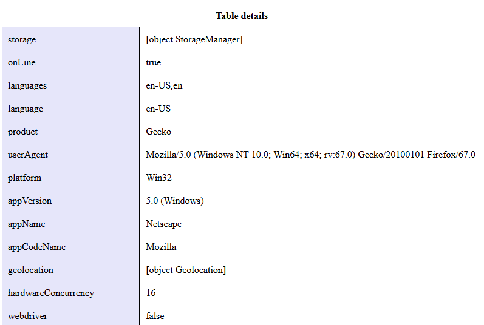

Web Lab 08 &ndash; Intermediate JavaScript
==========

Begin by forking this repository into your namespace by clicking the ```fork``` button above, then selecting your username from the resulting window. Once completed, click the ```clone``` button, copy the ```Clone with HTTPS``` value. Open IntelliJ, and from the welcome screen click ```Check out from Version Control -> Git```, then paste the copied URL into the ```URL``` field of the resulting window. Provide your GitLab username and password if prompted.

Explore the files in the project, familiarizing yourself with the content.

When complete, demonstrate your code to your tutor. This must be verified with your tutor by the end of the week.


Exercise 01 - Browser Details
-----------------------------

Open the file `ex01/browser_details.html` and inspect the contents. In this exercise, you will modify the  `browser_details.js` JavaScript file so that the page will tidily display the information contained in the window's `navigator` object inside the table. For information on the properties and methods available to you, [look at the MDN documentation of the object](https://developer.mozilla.org/en-US/docs/Web/API/Navigator). The output should look something like the following:

 

There are a number of properties to read from the navigator object and display in the table and it would take some time to write them out by hand. There is an approach you can use to loop over all of the property names in an object and print them and their contents. Take some time to look for solutions for this online.

Open your `browser_details.html` web page in different browsers (and perhaps different versions of a browser, if you try this from home) to see whether the information shown for each is as you expected. 

Compare the details for different browsers. For example, what's interesting is that Windows Edge reports itself as Mozilla and Netscape. You might now be able to appreciate why "browser sniffing" (detecting which browser and which version thereof is being used to visit your web page) using the navigator object's user-agent property would end up being hacky and can't be guaranteed to work with future versions of the same browser.


Exercise 02 - A Variable Gallery
--------------------------------

Open the file `ex02/gallery.html` and examine the contents. This web page has a central image and a thumbnail view of other images in the gallery at the bottom. There is an associated images folder containing both the full size images and a folder called `thumbs` containing the thumbnails named `0.gif` to `10.gif`.

In the form the example HTML file is given to you, when you load the page, it always displays the same image in the central part of the page—which we will refer to as the featured image area.

The aim of this exercise is to change the HTML file so it displays a random image in the 'featured' whenever the page is loaded, reloaded, or whenever the user clicks on the central 'featured' image. You will also support displaying a selected image when the user clicks on one of the thumbnail images.

#### A random image on page load

To begin we will address the issue of randomly loading a new image when the page is loaded, and check that is operating as desired in the browser. 

Begin by creating an event handler that will fire when the page has loaded fully. In this event handler, call the `loadRandomImage()` function to select and display a new image. Once complete, preview your file in a browser and refresh the page a few times to ensure that random images are loading.

The `changeImage()` function currently changes the featured image, but it does not update the tooltop (the text displayed when you hover over the featured image) or the description text. At the marked `TODO` positions, modify the function so that it retrieves the tooltip and description associated with the image and displays this on the page appropriately.

Preview your page and ensure this new behavior is working as expected.

#### A random image on click

Add another event handler to your JavaScript so that when the central 'featured' image is clicked, a new random image is chosen and displayed. Remember to reuse the `changeImage()` and `loadRandomImage()` functions appropriately.

Preview and test your code to ensure that a random image is still loaded when the page is refreshed, and that clicking the central image loads a new image.

#### Loading selected images 

Loading a random image is fantastic, but for a featured image gallery it would be good to be able to select which image we want to see. Declare a new function with a sensible name to be used as the event handler callback, then add new event listeners that will fire when any of the `thumb-holder` elements are clicked - setting their callback functions to the function you just created. In the single event handler callback, detect which thumbnail was clicked and use this information to set the featured image to the full sized version of the clicked thumbnail.

*HINTS*:
+ Your [event listener callback function](https://developer.mozilla.org/en-US/docs/Web/API/EventTarget/addEventListener#The_event_listener_callback) can take an [Event](https://developer.mozilla.org/en-US/docs/Web/API/Event) parameter. This parameter has the property `target` which indicates which element caused the event to fire in the first place
+ The `src` property of the clicked element will contain the filename of the thumbnail image. These are named `0.gif` through `10.gif`. The number in this filename corresponds to the index in the `imageCollection` array where the full sized image details can be found
  + You can use string manipulations to extract this number from the filename
+ Your `changeImage()` function will do the image loading for you once you have determined the appropriate image number

 Exercise 3 &ndash; JSON
 ==========
 
  
 Inside `video_rental.html` you will find 2 tables, `#details` and `#statistics`. Using JavaScript, you will process the JSON data found in `customerdb.js` to populate these tables. Try to use good programming practices to split the problem into logical chunks and make use of functions. Do not make any changes to the HTML in the file, you must use JavaScript only to generate the output.
 
 Within `video_rentals.js`, you have been provided with the constant `summaryStatistics` that provides a data structure that you can use to help store the statistics that you calculate for the table. 
 
 In the `#details` table, create and insert a `<thead>` containing the titles:
 
 ```json
 ["Name", "Gender", "Year born", "Year Joined", "Number of Rentals"]
 ```
 
 In this same table, create a `<tbody>` that contains one row for each entry in the JSON object. When complete, the output should look like that shown in the below screenshot.
 
 In the `#statistics` you will calculate and display some statistics about the customers found in the JSON. You will need to compute:
 
 + the total number of male customers
 + the total number of females customers
 + the total number of people in the age ranges 0-30, 31-64, and 65+
 + the tally of customers in various "loyalty status" tiers, where: 
   - those who borrowed more than 4 videos a week during the period of their membership are in the "gold" category. 
   - Those who borrowed between 1 and 4 videos per week are in the "silver" category
   - those with less than one video out per week are of the "bronze" category.
   
 The age of each user can be calculated using the current year and the year each member was born. Similarly to calculate which loyalty tier each user belongs to, you will need to compute how long they have been a member of the store, and use their total number of rentals to establish an average `movies_per_week` value.
 
 Once these statistics have been calculated, display them as shown in the below screenshot.
 
 